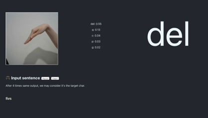

# 541 final project

**Author:**

- Rongzhe Liu (rongzhel@usc.edu)
- Chenhua Fan (chenhuaf@usc.edu)

## Files

This repository is the main workspace of our final project. It includes:

- `*.ipynb` **Jupyter notebooks of model we used** (main work).
- `ASLDataset.py` the initialization of dataset.
- `/trained_models` the models we trained.
- `/CustomResNet18` the web application (demo with fullly functional).
  - `/backend` the backend files for `torchserve`.
  - `/frontend` the frontend React app.
- `541 final report.mp4` **the demo of our application. Welcome to [checkout](https://youtu.be/8BdOX08LUug)**.

## Web application



`torchserve` [quick start](https://github.com/pytorch/serve/blob/master/README.md#-quick-start-with-torchserve)

```shell
pip install torchserve torch-model-archiver torch-workflow-archiver
```

`Nginx` must be installed, and add the redirection rules to the configuration.

```
location ^~ / {
    proxy_pass http://localhost:3000/;
}

location ^~ /api/ {
    proxy_pass http://localhost:8080/;
}
```

Run the application

```shell
git clone https://github.com/ChenhuaFan/541-Final-Project---Gesture-Recognition.git
cd 541-Final-Project---Gesture-Recognition/CustomResNet18/backend
# start the torchserve (torchserve must be installed)
torchserve --start --ncs --model-store model_store --models CustomResNet18.mar
# run the frontend (npm must be installed)
cd ../frontend
npm i
npm start
```
